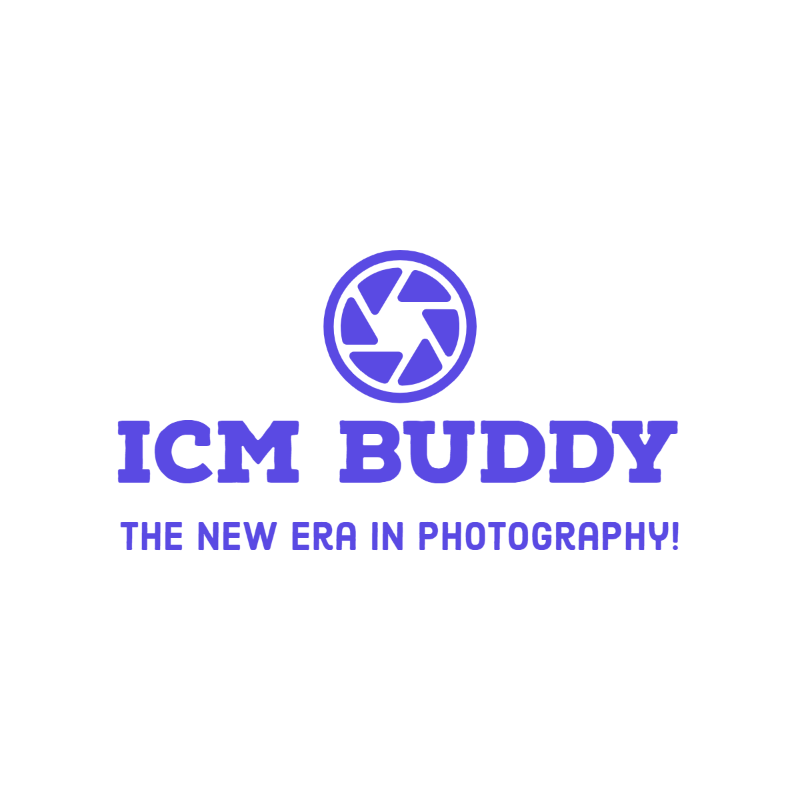
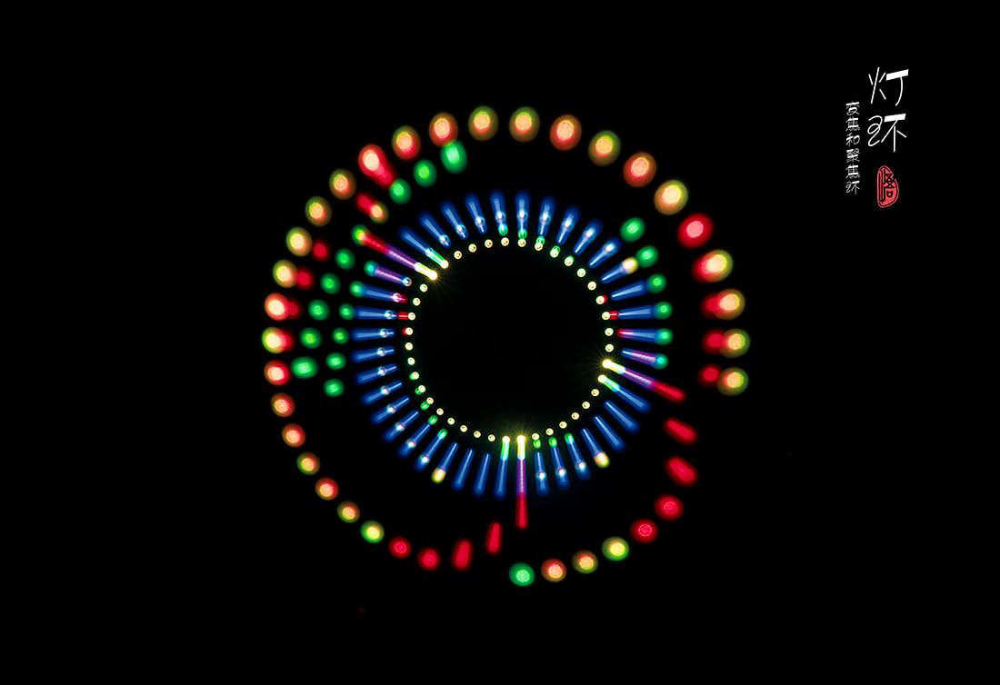
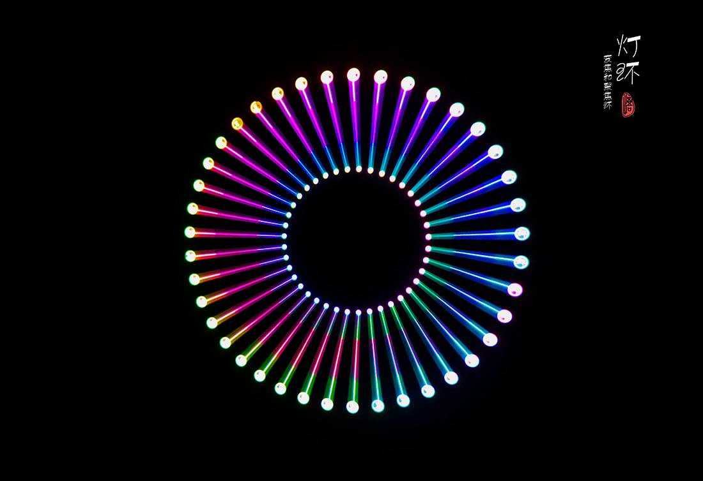

<div id="top"></div>
<!--
*** Thanks for checking out the Best-README-Template. If you have a suggestion
*** that would make this better, please fork the repo and create a pull request
*** or simply open an issue with the tag "enhancement".
*** Don't forget to give the project a star!
*** Thanks again! Now go create something AMAZING! :D
-->


<!-- PROJECT SHIELDS -->
<!--
*** I'm using markdown "reference style" links for readability.
*** Reference links are enclosed in brackets [ ] instead of parentheses ( ).
*** See the bottom of this document for the declaration of the reference variables
*** for contributors-url, forks-url, etc. This is an optional, concise syntax you may use.
*** https://www.markdownguide.org/basic-syntax/#reference-style-links
-->
[![Issues][issues-shield]][issues-url]
[![MIT License][license-shield]][license-url]
[![LinkedIn][linkedin-shield]][linkedin-url]


<!-- PROJECT LOGO -->
<br />
<div align="center">
  <a href="https://github.com/SeaBoiii/FYP">
    
  </a>

<h3 align="center">ICM Buddy</h3>

  <p align="center">
    The projective objective is to improve the user experience for experienced and new photographers by providing automation to the camera during the long exposure shoot.
    <br />
    <a href="https://github.com/SeaBoiii/FYP/blob/main/.documents/ICM_Buddy_Final_Report.pdf"><strong>Explore the docs »</strong></a>
    <br />
    <br />
    <a href="https://www.youtube.com/watch?v=y02GOHybE4I">View Demo</a>
    ·
    <a href="https://github.com/SeaBoiii/FYP/issues">Report Bug</a>
    ·
    <a href="https://github.com/SeaBoiii/FYP/issues">Request Feature</a>
  </p>
</div>


<!-- TABLE OF CONTENTS -->
<details>
  <summary>Table of Contents</summary>
  <ol>
    <li>
      <a href="#about-the-project">About The Project</a>
      <ul>
        <li><a href="#built-with">Built With</a></li>
      </ul>
    </li>
    <li>
      <a href="#getting-started">Getting Started</a>
      <ul>
        <li><a href="#prerequisites">Prerequisites</a></li>
        <li><a href="#installation">Installation</a></li>
      </ul>
    </li>
    <li><a href="#usage">Usage</a></li>
    <li><a href="#contributing">Contributing</a></li>
    <li><a href="#contact">Contact</a></li>
    <li><a href="#acknowledgments">Acknowledgments</a></li>
  </ol>
</details>


<!-- ABOUT THE PROJECT -->
## About The Project

![Product Name Screen Shot][product-screenshot]

This project aims to improve the consistency of the results obtained from long exposure photography and present new ways to take slow exposure photos by automating the movements of the focus and zoom lens during the shoot. With the pre-sets available in the project, photographers will be able to control the type of resulting images that they can get. 

This project was designed and implemented to produce a system capable in conducting a long exposure shoot with unique sequences to get the optimal long-exposure image results. Through the integration of hardware and software, high precision, and consistency of the DSLR lens rotation could be achieved. This unfolds an endless possibility for both experienced and aspiring photographers in long exposure photography.

From the confident results gathered during testing, this project can produce a consistent and repeatable long exposure image. Paired with the various patterns extended with the custom pattern that user can input, various beautiful long exposed images can be taken.

<p align="right">(<a href="#top">back to top</a>)</p>


### Built With

* [Arduino](https://www.arduino.cc/)

#### Hardware Required
| Name | Quantity | Description |
| --- | ------| -------|
|     Arduino Nano                         |     1    |     Small ATmega328 microcontroller                                                                             
|     TMC2208 Stepper Driver               |     2    |     Ultra-quiet two-phase stepper   motor drive chip, to drive the stepper motors                                                            |   |   |
|     NEMA 17 Stepper Motor                |     2    |     High torque motors to provide   precision movements of the lens                                                                          |   |   |
|     Buzzer                               |     1    |     Sound indicator for users to   know before and after a certain sequence is executed                                                      |   |   |
|     1.8’ TFT Display                     |     1    |     Menu selector to control the   lens                                                                                                      |   |   |
|     Optocoupler P627                     |     1    |     Isolates the circuit from the   camera shutter. Prevents damaging the circuit by high current when the camera   shutter is triggered.    |   |   |
|     2.5mm Jack                           |     1    |     Connector for DSLR Camera’s   shutter                                                                                                    |   |   |
|     5 Pin Joystick                       |     1    |     Menu movements to select the   different options in the menu                                                                             |   |   |
|     220 Ω Resistor                       |     5    |     Limit the current to the TFT   display                                                                                                   |   |   |
|     1k Ω Resistor                        |     1    |     Limit the current to the   Optocoupler                                                                                                   |   |   |
|     100 µF Capacitor                     |     1    |     Prevents accidental damage to   the drivers in case of current surge                                                                     |   |   |
|     11.1V Lipo Battery                   |     1    |     Power supply for the entire   hardware                                                                                                   |   |   |
|     DSLR Camera                          |     1    |     For capturing the long exposure   images                                                                                                 |   |   |
|     Arca-Type   compatible DSLR rail     |     1    |     Motors can be mounted along the   rail                                                                                                   |   |   |
|     0.8 Mod Gear Rings                   |     2    |     Rings attached to the focus   & zoom lens                                                                                                |   |   |
|     KW12-3 Limit Switch                  |     4    |     [Optional] For further control   to the lens                                                                                             |   |   |


<p align="right">(<a href="#top">back to top</a>)</p>


<!-- GETTING STARTED -->
## Getting Started

The first thing that you will have to do is to create the same setup. The same setup, can be done using the circuit diagram found in the folder. All the hardware required were mentioned above. 

<a href="https://github.com/SeaBoiii/FYP">
    
  </a>

If creating the board is to tedious, you can always print a PCB for easier replica of the project. The details of the PCB can be found at [PCB Designs](https://github.com/SeaBoiii/FYP/tree/main/.3D_Designs/PCB).

### Prerequisites

The only software requirement is the Arduino IDE to flash the program to the Arduino. 
* [Arduino](https://www.arduino.cc/en/Guide)

#### Libraries Used

All the libraries used can be downloaded using the IDE or downloaded manually and dropped to the library folder. Only the `AccelStepper` library required to be downloaded while the rest of the library should be pre-installed in the Arduino IDE.
* [AccelStepper](https://www.airspayce.com/mikem/arduino/AccelStepper/)
* [TFT](https://www.arduino.cc/reference/en/libraries/tft/)
* [EEPROM](https://docs.arduino.cc/learn/built-in-libraries/eeprom/)

### Installation

1. Build the prototype first
2. Clone the repo
   ```sh
   git clone https://github.com/SeaBoiii/FYP.git
   ```
3. Install required Arduino libraries
   ```sh
   arduino install AccelStepper
   ```
4. Upload Motor_ICM.ino to the Arduino Microcontroller
   ```sh
   upload Motor_ICM.ino
   ```

<p align="right">(<a href="#top">back to top</a>)</p>


<!-- USAGE EXAMPLES -->
## Usage

The menu of the prototype is very intuitive and navigation can be done smoothly. After attaching the device to your lens, the 1st thing that you would want to do is `calibration`. This allows the motors to remember the marked locations to prevent any damages to the lens. Explore the various menus and patterns available by default to generate interesting long exposure images. 

If the installed patterns are not to your liking, feel free to edit the code and change it or even use the inbuilt custom patterns to build your own custom patterns. Here are more examples of what this device is capable of.

<a href="https://github.com/SeaBoiii/FYP">
    
</a>

<p align="center">
Using both the movements of the focus and the zoom lens, this shot was taken at the Old Supreme Court building in Singapore.
</p>
  
<a href="https://github.com/SeaBoiii/FYP">
    
</a>

<p align="center">
Again, both the focus and zoom lens were used to create a circular motion effect of lights. 
</p>
  
<a href="https://github.com/SeaBoiii/FYP">
    
</a>

<p align="center">
Only the zoom lens were moved here to create a tunnel vision look.
</p>
  
_For more examples, please refer to the [Documentation](https://github.com/SeaBoiii/FYP/blob/main/.documents/ICM_Buddy_Final_Report.pdf)_

<p align="right">(<a href="#top">back to top</a>)</p>


<!-- CONTRIBUTING -->
## Contributing

Contributions are what make the open source community such an amazing place to learn, inspire, and create. Any contributions you make are **greatly appreciated**.

If you have a suggestion that would make this better, please fork the repo and create a pull request. You can also simply open an issue with the tag "enhancement".
Don't forget to give the project a star! Thanks again!

1. Fork the Project
2. Create your Feature Branch (`git checkout -b feature/AmazingFeature`)
3. Commit your Changes (`git commit -m 'Add some AmazingFeature'`)
4. Push to the Branch (`git push origin feature/AmazingFeature`)
5. Open a Pull Request

<p align="right">(<a href="#top">back to top</a>)</p>


<!-- CONTACT -->
## Contact

Project Link: [https://github.com/SeaBoiii/FYP](https://github.com/SeaBoiii/FYP)

<a href="mailto:seaboiiigamer@gmail.com"></a>	
<a href="https://github.com/SeaBoiii/"></a>
<a href="https://www.linkedin.com/in/a1e3m/"></a>
<a href="https://instagram.com/a1e3m/"></a>
<a href="https://t.me/a1e3m"></a>
<p align="right">(<a href="#top">back to top</a>)</p>

<!-- ACKNOWLEDGMENTS -->
## Acknowledgments

* A/P Chia - My FYP mentor, someone who helped me throughout the whole project
* Auntie @ SimLim Tower - For providing any extra hardware required for my own testings

<p align="right">(<a href="#top">back to top</a>)</p>


<!-- MARKDOWN LINKS & IMAGES -->
<!-- https://www.markdownguide.org/basic-syntax/#reference-style-links -->
[contributors-shield]: https://img.shields.io/github/contributors/SeaBoiii/FYP.svg?style=for-the-badge
[contributors-url]: https://github.com/SeaBoiii/FYP/graphs/contributors
[forks-shield]: https://img.shields.io/github/forks/SeaBoiii/FYP.svg?style=for-the-badge
[forks-url]: https://github.com/SeaBoiii/FYP/network/members
[stars-shield]: https://img.shields.io/github/stars/SeaBoiii/FYP.svg?style=for-the-badge
[stars-url]: https://github.com/SeaBoiii/FYP/stargazers
[issues-shield]: https://img.shields.io/github/issues/SeaBoiii/FYP.svg?style=for-the-badge
[issues-url]: https://github.com/SeaBoiii/FYP/issues
[license-shield]: https://img.shields.io/github/license/SeaBoiii/FYP.svg?style=for-the-badge
[license-url]: https://github.com/SeaBoiii/FYP/blob/master/LICENSE.txt
[linkedin-shield]: https://img.shields.io/badge/-LinkedIn-black.svg?style=for-the-badge&logo=linkedin&colorB=555
[linkedin-url]: https://linkedin.com/in/a1e3m
[product-screenshot]: .images/screenshot.jpg
